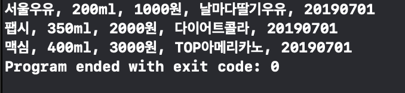

# Step1 - 음료수 클래스 생성 (1.7.19)

## 구조

- **Product (class):** 제품의 속성(brand, capacityl, price, name, date)을 가지는 클래스
- **Milk (class):** Product를 상속하고, brand를 "서울우유"로 가지는 클래스
- **Soda (class):** Product를 상속하고, brand를 "팹시"로 가지는 클래스
- **Coffee (class):** Product를 상속하고, brand를 "맥심"로 가지는 클래스
- **DateUtil (struct):** date에 대한 데이터를 가지고 있는 구조체
  - **dateFormatter:** "yyyyMMdd"의 포맷을 가지는 상수
  - **convertDate(of text: String) -> Date:** 입력받은 문자열을 Date타입으로 바꿔주는 함수
  - **convertText(of date: Date) -> String:** Date타입을 문자열로 바꿔주는 함수

## 피드백에 대한 개선 내용

**피드백 받은 사항:** Product타입의 인스턴스를 여러개 만들어서 출력하였다.

**피드백 내용:** 요구사항은 상속을 기본적으로 구현하고 Product를 상속하는 타입들을 가지는 인스턴스를 생성해야한다.

**수정한 내용:** Product를 상속받는 Milk, Soda, Coffee 클래스를 추가하여 이를 가지는 인스턴스들을 생성했다.

## 해당 Step을 진행하면서 배운 내용

**클래스:** [오늘의 Swift 상식 (Struct, Class)](https://medium.com/@jgj455/오늘의-swift-상식-struct-class-60fa5fd2218d)

**프로토콜:** [오늘의 Swift 상식 (Protocol)](https://medium.com/@jgj455/오늘의-swift-상식-protocol-f18c82571dad)

## 결과 화면

