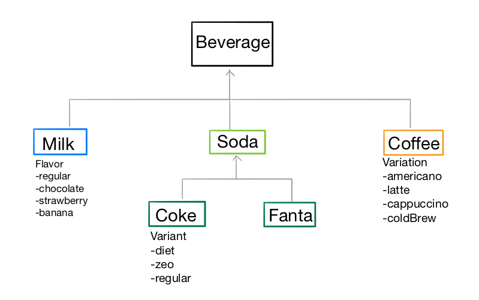

# Step 12. 자판기

## 12-1. 음료수 클래스

### Beverage class

- 음료수의 공통 property & `CustomStringConvertible` 준수
- `productName` property  = brand 이름 + 특성(있을 경우)
  - 제품 이름은 주로 brand 이름 뒤에 해당 브랜드 내의 카테고리 중 하나이므로 출력시에 사용될 `productName` computed property 를 지정하여 사용함

### Milk class

내부 enum `Flavor` 로 딸기/초코/바나나 

### Coffee class

내부 enum `Variation` 으로 아메리카노/카푸치노 등을 구분

### Soda class

탄산음료 객체를 나타냄

### Coke class

내부 enum `Variant` 으로 다이어트/제로 콜라 등을 구분

### Fanta class

- 내부 enum `Flavor` 으로 오렌지/포도 맛 등을 구분
- Fanta 는 단일 브랜드, 제조사는 한국코카콜라에서만 제조하므로 type property 로 지정함