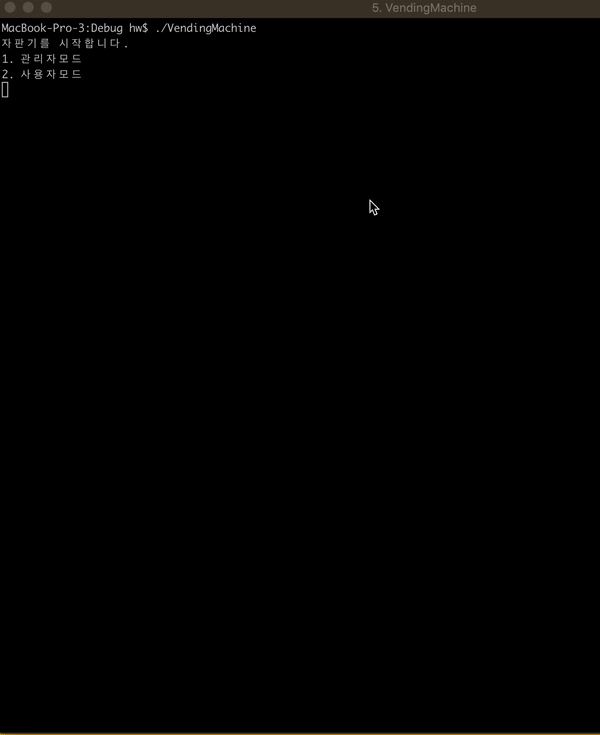

# STEP 3

## Intro

### vendingmachine의 기능은 2가지

1. **금액추가**

   1 10000	(금액추가명령/추가할 금액)

2. **음료구매** 

   2 1  			(음료구매명령/음료수 번호 선택)

Instrcution에 따라 vendingmachine의 상태는

- 초기상태 / 대기 / 판매(가능) /금액추가
  - initial/ready/selling/chargeMoney/ 의 상태로 변경
  - 재고부족과 물품가격 대비 잔액부족의 상태는 예외처리로 변경

## 자판기 상태에 대한 분석

> State pattern을 적용하여  자판기의 로직을 구현

### 자판기 처음 시작시 상태 전이

- InitialState -> ReadyState

금액추가 상태전이

- ReadyState -> 1 -> chargeMoney

금액 추가후 상태 전이

- chargeMoney -> ReadyState

음료구매 상태전이 

- ReadyState -> 2 -> sellingState

음료구매시 재고부족 상태전이

- selling -> outofstock 체크 -> ReadyState

음료구매시 잔액부족 상태전이

- sellingState -> balance 체크 -> notEnoughMoney 체크 ->  ReadyState

### 기타 구현 요구 사항

- 각각의 등록된 음료수를 비교하여, 이름이 같고, 가격이 같은 경우에만 동일 상품 리스트로 취급한다.

- 상품메뉴 이름과 번호를 매핑한 딕셔너리(drinkNameMenuTable)와 실제 입력한 숫자에 매핑된 재고테이블(drinkStockTable)로 재고를 관리

  

## Unit Test 항목

- Mock 객체를 생성하여 자판기의 요구사항 메서드들에 대한 다음의 테스트 진행
  - 유통기한 지난 품목에 대한 리스트 조회 / 구매가능여부 테스트
  - 자판기 금액 충전 메소드 테스트 
  - 특정 상품 인스턴스로 재고를 추가하는 메소드 테스트
  - 구매가능한 음료수 목록을 리턴하는 메소드 테스트
  - 음료수 구매 메소드 테스트
  - 잔액 확인 메소드 테스트
  - 전체 상품 재고를 (사전으로 표현하는) 종류별로 리턴하는 메소드 테스트
  - 유통기한이 지난 재고만 리턴하는 메소드 테스트
  - 따뜻한 음료(50도 이상)만 리턴하는 메소드 테스트
  - 시작이후 구매 상품 이력을 배열로 리턴하는 메소드 테스트

- 해당 객체의 기능테스트에 따라 발생가능한 예외출력에 대한 테스트도 시행

# STEP 4

- 재고 추가/삭제를 위한 `관리자 모드` 추가
  - 관리자를 위한 상태와 사용자를 위한 상태 분리
- 관리자모드 <-> 사용자 모드 간 전환이 이뤄지도록 로직 설계
- 예외 처리 및 단위테스트 수행 

## 재고 추가

- 신규 재고 추가시 새로운 메뉴테이블/재고아이템리스트 딕셔너리 값을 업데이트함.
- 음료수 번호/수량 선택으로 추가 가능

## 재고 삭제

- 기존 재고 삭제시 딕셔너리의 변경은 없음
  - 추가적으로 동일 제품이 들어오는 것에 대해 고려
- 잔존 재고보다 많은 재고 삭제하려는 경우, 현존 최대 재고만큼만 삭제
- 잔존 재고가 없는 경우에 대한 예외 처리 반영
  - 재고가 없는 경우에도 음료수 타입에 대한 정보를 반영할 수 있도록, 프로퍼티 추가.
  - 기존에 이를 위해 사용하던 BeverageInfo를 향후 연관된 STEP 13에서 제거하도록 할 것 

## ETC

- 자판기의 재고를 변경하는 상태들에 대한 공통 프로토콜 `StockManipulatable` 설정

- 재고 상태 변경과 관련된 출력문자열을 `AuxiliaryStockStateModifying` 클래스의 static 함수를 통해 공통으로 처리 

  

## Unit Test 항목

1) 재고추가 : 기존 유닛테스트를 일부 수정 (수량 입력받을 수 있도록 수정)

2) 재고 삭제 : 각각의 테스트 상황에 따른 단위테스트 추가

### 결과화면

